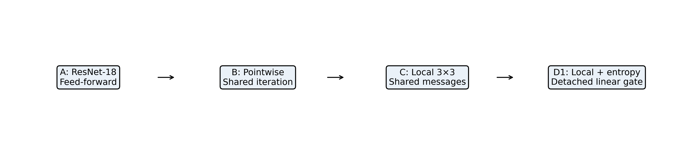

# Controlling Iterative Local Communication for Visual Recognition

Code and reproducibility materials for **“Controlling Iterative Local Communication for Visual Recognition: Stability, Uncertainty, and Robustness”**, by Fiseha Berhanu Tesema, University of Nottingham Ningbo China.

This manuscript studies iteration, spatial communication, uncertainty control and numerical stability using a controlled CIFAR-adapted ResNet-18 ladder. Publication and review status are not asserted here.

## Overview



| Model | Mechanism |
|---|---|
| A | Feed-forward CIFAR ResNet-18 |
| B | Shared pointwise iterative refinement |
| C | Recurrent shared depthwise 3×3 local communication |
| D1 | C with detached normalized predictive entropy as a linear gate |

T and residual scale λ are configurable. D2 (square root), D3 (cube root), and D4 (floor-linear) are secondary gate ablations.

## Main findings

- Pointwise iteration underperforms the baseline; local communication improves over pointwise iteration.
- Recurrent C-T3 is higher than one-shot C-T1 across three tested seeds, but the paired small-sample confidence interval includes zero.
- Fixed C exhibits repeated numerical instability. Failed seeds are retained, not replaced.
- D1 shows a positive CIFAR-10-C robustness trend, with a confidence interval crossing zero.
- D1 does not improve CIFAR-100 accuracy.
- D1 is an adaptive communication controller, not a universally superior model or a guarantee of stability.

The exact original Phase 1 implementation is preserved in [historical/phase1](historical/phase1/), with an explicit [source-version mapping](docs/source_version_mapping.md).

See [result interpretation](docs/result_interpretation.md) for the limits of these claims.

## Installation

The recorded environment is pinned in [environment.yml](environment.yml) and [requirements.txt](requirements.txt), with measured package versions in [environment.json](docs/environment.json).

```bash
conda env create -f environment.yml
conda activate iterative-local-communication
export CUBLAS_WORKSPACE_CONFIG=:4096:8
python -m pytest -q
```

The tested Python is 3.13.5 with PyTorch 2.9.1+cu130 and CUDA build 13.0. Install the matching PyTorch wheel from its official wheel index if it is not available on your package index:

```bash
python -m pip install torch==2.9.1+cu130 torchvision==0.24.1+cu130 --index-url https://download.pytorch.org/whl/cu130
python -m pip install -r requirements.txt
```

PyTorch wheels provide their CUDA runtime dependencies; a compatible working NVIDIA driver and exposed GPU are still required for real experiments. No standalone CUDA toolkit compilation is required by this project. CPU is sufficient for unit tests and synthetic smoke checks.

## Dataset preparation

CIFAR-10 and CIFAR-100 are obtained through torchvision's dataset download support using the commands below. Dataset information is available from the [CIFAR project](https://www.cs.toronto.edu/~kriz/cifar.html). CIFAR-10-C comes from the [canonical Zenodo record](https://zenodo.org/records/2535967). The corruption downloader verifies its recorded archive checksum.

```text
data/
├── cifar-10-batches-py/
├── cifar-100-python/
└── CIFAR-10-C/
```

Images are excluded from this repository. Dataset terms apply independently of the code license. Splits are deterministically regenerated and verified using [seed-specific hashes](splits/hashes.json).

## Reproduce clean CIFAR-10

Run from the repository root. First inspect the matrix, then execute it on CUDA:

```bash
python -m scripts.run_experiment_matrix --suite cifar10
python -m scripts.run_experiment_matrix --suite cifar10 --execute --download --resume
python -m scripts.aggregate_experiments --suite cifar10
```

The matrix includes the A/B/C/D1 ladder and recorded D2/D3/D4 ablations. It retains all planned failed seeds. Use `python -m scripts.train --config configs/cifar10/cifar10-A-baseline-seed1.yaml --smoke` for a lightweight synthetic check; this produces no scientific result.

## Reproduce CIFAR-10-C

First reproduce or obtain the successful A/C/D1 checkpoints and summaries. The failed C seed4 is not evaluated.

```bash
python -m scripts.evaluate_cifar10c --download --checkpoints-root runs
python -m scripts.aggregate_experiments --suite cifar10c
```

All 19 distributed corruption types and five severities are evaluated. Per-cell outputs go to `outputs/final_cifar10c/`; archived aggregate, per-corruption and per-severity results are in [results/cifar10c](results/cifar10c). These are unnormalized accuracies, not mCE.

## Reproduce CIFAR-100

```bash
python -m scripts.run_experiment_matrix --suite cifar100 --execute --download --resume
python -m scripts.aggregate_experiments --suite cifar100
```

## Reproduce iteration ablation

```bash
python -m scripts.run_experiment_matrix --suite iteration_ablation --execute --download --resume
python -m scripts.aggregate_experiments --suite iteration_ablation
```

C and D1 use T=1,2,3,5. T3 reuses the clean run IDs. C-T1 is the one-shot spatial control; no additional one-shot model is invented.

## Reproduce communication-strength ablation

```bash
python -m scripts.run_experiment_matrix --suite communication_strength --execute --download --resume
python -m scripts.aggregate_experiments --suite communication_strength
```

The λ=1 runs reuse the historical C references. The λ=0.25 and λ=0.50 runs use the original Phase 4 engine.

## Generate manuscript tables

```bash
python -m scripts.generate_manuscript_results
python -m scripts.measure_efficiency --config configs/cifar10/cifar10-A-baseline-seed1.yaml
```

This regenerates tables and figures from the included recorded measurements under `outputs/regenerated/`, without training. Archived tables and PNG/PDF figures remain in `tables/` and `figures/`. New-run aggregation remains separate from manuscript records.

For checkpoint-level calibration and refinement diagnostics (trusted checkpoints only):

```bash
python -m scripts.evaluate runs/cifar10-A-baseline-seed1/best.pt
python -m scripts.analyze_refinement runs/cifar10-D1-linear-t3-seed1/best.pt --features --messages
```

Use the exact run IDs printed by the matrix. Refinement analysis includes corrected/damaged outcomes, uncertainty quartiles and effective communication updates. The preserved `src/final_experiments/efficiency.py` contains the Conv2d/Linear MAC counter; training records synchronized validation latency.

## Numerical stability diagnostics

[diagnostics/](diagnostics/) contains the C-T3 seed4 report, two unchanged reproduction records, C-T5 seeds1–3 failures and CIFAR-100 C seeds1–2 failures. Event coordinates, input checks and failure classifications are retained. No failed run is relabeled successful. Captured large model states are excluded and require a separate archive for exact event-state replay.

## Results

Accuracy is mean ± sample SD in percent; C statistics are conditional on successful runs.

| Model | CIFAR-10 successes/attempts | CIFAR-10 accuracy | CIFAR-100 successes/attempts | CIFAR-100 accuracy |
|---|---:|---:|---:|---:|
| A | 5/5 | 95.202 ± 0.145 | 3/3 | 77.780 ± 0.070 |
| B | 3/3 | 94.877 ± 0.137 | — | — |
| C | 4/5 | 95.143 ± 0.095 | 1/3 | 77.340 (SD unavailable) |
| D1 | 5/5 | 95.138 ± 0.210 | 3/3 | 76.680 ± 0.606 |

The 19-corruption paired D1−A difference is **+0.546 percentage points**, 95% CI **[−0.564, 1.656]**, n=5. C-T3−C-T1 is **+0.267 points**, CI **[−0.007, 0.540]**, n=3. All three C-T5 attempts failed. C-λ0.25 and C-λ0.50 completed 5/5 with 94.868 ± 0.180 and 94.538 ± 0.996 accuracy respectively.

Machine-readable records include calibration, gates, uncertainty groups, communication dynamics, timing and paired seed contrasts. Compute counts are partial Conv2d/Linear arithmetic counts; **total model FLOPs are not available**. Historical table rounding is documented in the interpretation notes.

## Citation

```bibtex
@misc{tesema_iterative_local_communication,
  author = {Tesema, Fiseha Berhanu},
  title = {Controlling Iterative Local Communication for Visual Recognition: Stability, Uncertainty, and Robustness},
  howpublished = {Manuscript and reproducibility materials},
  url = {https://github.com/Falmi/iterative-local-communication}
}
```

See [CITATION.cff](CITATION.cff). No DOI, journal issue, acceptance status or official publication year is asserted.

## License and reproducibility limits

Code is licensed under MIT. Dataset licenses are separate. No pretrained checkpoints or datasets are bundled. See [reproducibility notes](docs/reproducibility_notes.md) and [checkpoint archive plan](docs/checkpoint_archive_plan.json).
